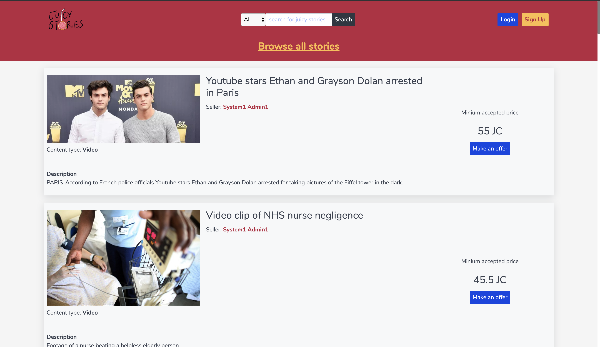
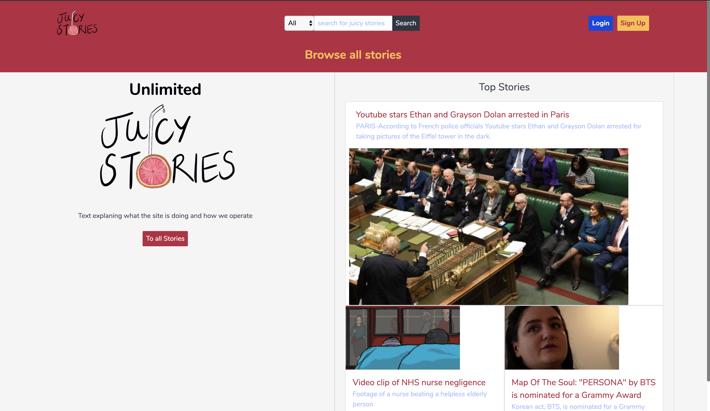
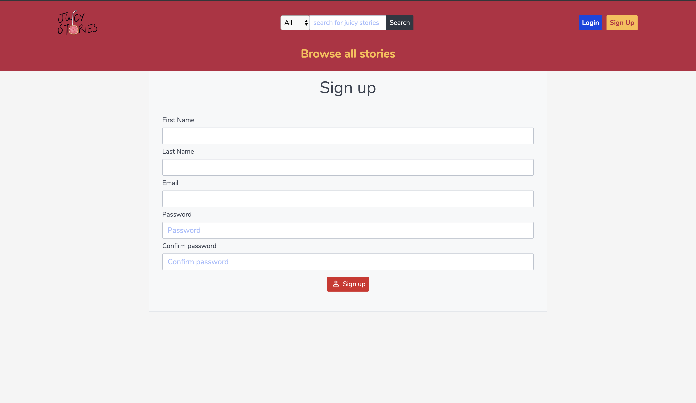
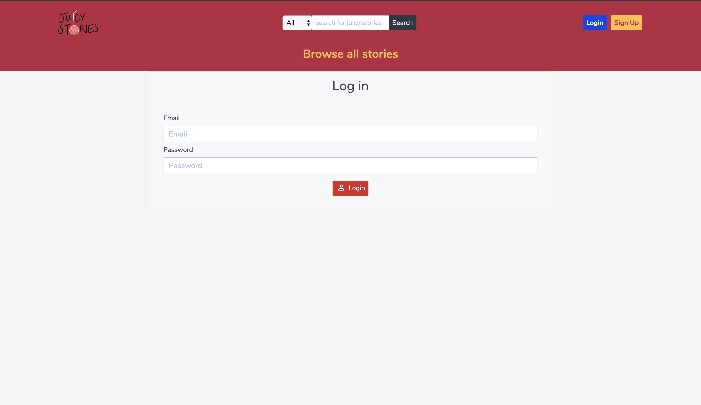
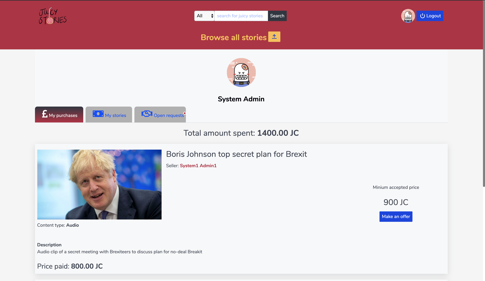
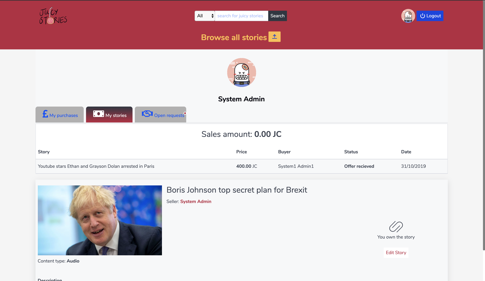
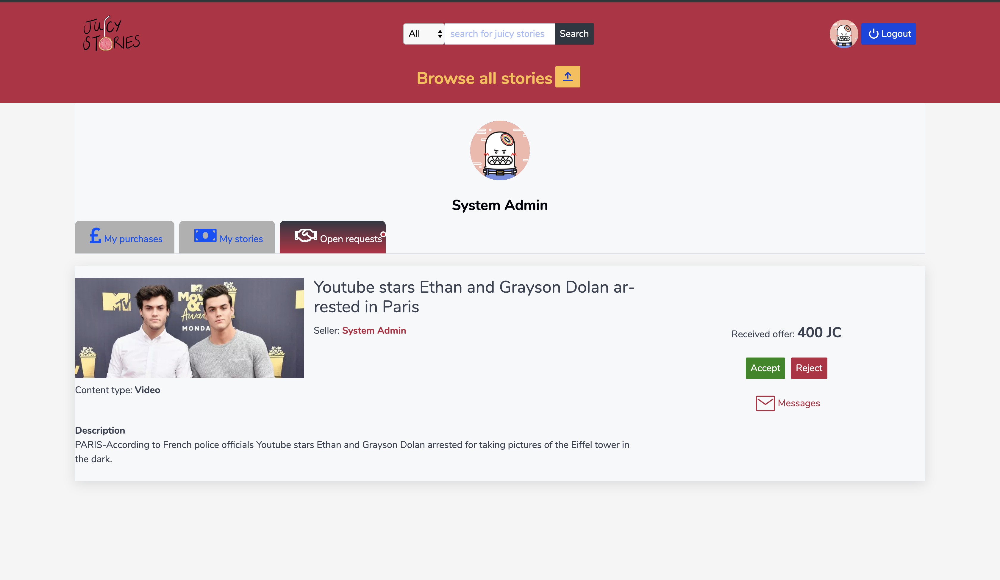

# SEI - Juicy Stories- Project 3
Our third project consisted of building a marketplace for content in one week.

---

# Marketplace for publishers to purchase content.

We were tasked with creating a full MERN stack web application , from an idea we came up with ourselves. - Coming up with an idea sounds much easier then it is! You have to consider product viability , time alloted to you and your team. The complexeties of the end product. 

## Built With

1. React
2. Mongoose
3. NodeJS
4. Express

## Marketeplace Mechanics

A online marketplace where users can sign-up to either list content to sell or find exclusive content to purchase. You arrive at a homepage which lists the top three stories / three pieces of exclusive content. The page consists of a navbar that has a logo. A search bar where you can search for specific video,images and audio. The login button which redirects to a login page. The sign-up button which redirects to a sign-up page and finally a button which links to a page listing all the stories/content available.Then theirs two sections. One which gives a minor explanation of the website with a button which redirects to all stories. The second one which lists the top three most visted stories (not built in yet).  

The user jurney is to first register on the sign up page to get access to make any transaction on the page. This feature is useing the mongoose interface to the mongo db and JWT token for authorisation. 

After sign up the user is directed the the login page for authorisation.

Once a user is signed-in , the user have access to a dashboard in which the user can view their purchases and sales. Also here is the access area in which they can negotiate pricing on the stories they're buying and selling. 

## Code and structure

The code is written in VS code and react. We used the mogoos nonSQL database to make store the data and user information. We did not have the means to store puictures locally so they are fron the internet. We made a seeds file to preload the data and users to the database to keep control and a the "faker" to create users. 
  
 
The react components can be seen in the structure and made it possible to reuse code more places 

## Test
We added the users login since this is importend for this type of site. The test will check for wrong type of login, too easy login and wrong password. 

## Challanges in this project.
The group worked well together even though the diffece of the coding skills were large. This gave me opportunity to learn a lot but at the same time having a challenge following the more complex ways of doing the code.
I made the backend API in mongo and most of the Authorisation. The takeaway learning was how importend it is to make a good plan for how to structure the data.   

## Added Extra Features
Of extra features we added the small counter on "open request" tab to indicate messages have been send to the logged in user.

## Author

Morten Elbo - https://github.com/mElbo-dk
